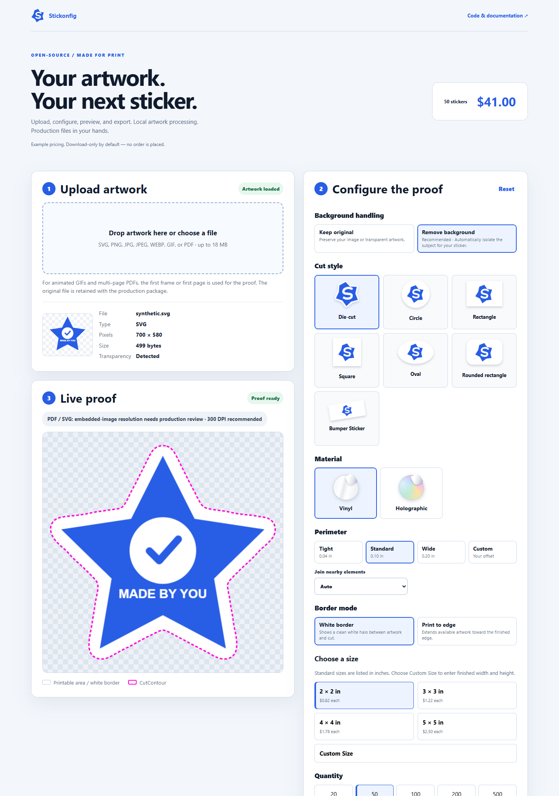

# Stickonfig

**Open-source custom sticker and decal configurator for print shops.**

Upload artwork, remove backgrounds locally, generate die-cut contours, preview the finished sticker, evaluate resolution, configure size and quantity, and export production files with vector CutContour paths.

Stickonfig is a gift of code, not a hosted service. Deploy it yourself, link to it from your existing website, or hand this repository to your web developer.



## What is included?

- SVG, PNG, JPG/JPEG, WEBP, GIF first-frame and PDF first-page artwork input.
- Local U2NetP/ONNX background removal, transparent-art preservation, subject-aware cleanup and nearby appendage support.
- Padded masks, concave contours, nearby-element grouping, multiple paths and Clipper2 physical offsets; smoothed photographic curves.
- Die cut, circle, oval, rectangle, square, rounded rectangle and bumper shapes.
- Tight / Standard / Wide / Custom perimeter, including negative inset cuts.
- Border / print-to-edge modes; zoom and drag inside geometric cuts.
- Aspect-ratio locking, quarter-inch size controls, presets and quantities.
- Configurable placeholder pricing, laminate and optional manual enhancement requests.
- Vinyl / holographic material options with a **proof-only** iridescent simulation.
- Effective source DPI tiers and low-resolution confirmation; vector-container quality is marked unverified, not blindly rated.
- Eight downloadable artifacts, including a solid **0.25 pt named CutContour spot-color PDF**, SVG, JSON, mask and job manifest.
- Desktop/mobile UI and a local `?debug=1` mask/geometry inspection view.

**All core functionality, including PDF and ZIP generation, works on static hosting without a backend.** Download mode does not send an order or accept payment. Optional adapters connect your own backend.

## Who is it for?

Independent print shops, franchise print/mail stores, sign shops, sticker producers, and developers building print storefronts.

It is **not** hosted SaaS, a payment processor, an official Annex Brands product, a turnkey Wix plugin, or guaranteed production support. Test generated files with your RIP before relying on them commercially.

## Quick start

Install Node.js 22.13+ (Node 24 tested) and Git, then:

```sh
git clone https://github.com/azdrugdoc-prog/stickonfig.git
cd stickonfig
npm install
npm run dev
```

Open the local URL shown in your terminal (normally `http://127.0.0.1:4173`). Upload `public/samples/constellation.svg` to try it. The first segmentation run loads the bundled model and WASM runtime and may take several seconds.

Edit **[stickonfig.config.mjs](stickonfig.config.mjs)** for branding, price policy, quantities, sizes, options, DPI thresholds and submission mode. Rebuild/restart after edits. All example prices are placeholders — review them before accepting orders. This file is public; never put secrets in it.

```sh
npm run build     # publish only dist/ to a static HTTPS host
npm run preview   # inspect that production build locally
```

## Choose your integration

| Approach | Good for | Start here |
|---|---|---|
| Standalone link | Simplest route for a shop using Wix or another site builder | [Quick start](docs/QUICK_START.md), [Wix guide](docs/WIX.md) |
| iframe | Keeping the configurator inside an existing site page | [Embed example](examples/iframe/index.html) |
| Custom integration | Your cart, checkout, storage and order process | [Developer guide](docs/DEVELOPER_GUIDE.md) |
| Static hosting | Cloudflare Pages, Netlify, Vercel, ordinary static/Node hosting | [Deployment guide](docs/DEPLOYMENT.md) |
| Backend intake | Generic multipart REST/webhook or optional Worker | [Submission contract](docs/DEVELOPER_GUIDE.md#submission-contract), [Cloudflare example](examples/cloudflare/README.md) |

## Production files and limitations

See [OUTPUTS.md](docs/OUTPUTS.md). The cutline is vector; normalized artwork is a bounded **RGB raster**, even when the original is PDF/SVG. Default print raster maximum is 1200 pixels on the longest side; this can limit output DPI for large stickers. Original artwork is retained for production reprocessing. This is not PDF/X certification, automatic prepress, color management, or guaranteed image enhancement. Hair, limbs, overlapping subjects, transparency and complex PDFs need careful review.

## Tests

```sh
npm test
npm run build
npx playwright install chromium
npm run test:browser
npm run audit:licenses
npm run audit:public
```

Tests use generated fixtures, not customer files. [Verification notes](docs/VERIFICATION.md) distinguish local checks from hosting/RIP integrations that have not been certified.

## License, origin and support

Original project code: **[MIT](LICENSE)**. Third-party libraries and weights retain their respective permissive licenses; see [THIRD_PARTY_NOTICES.md](THIRD_PARTY_NOTICES.md).

Stickonfig was originally developed as part of the WePrintEagle custom print storefront and later extracted as a reusable open-source project. The originating storefront remains separate.

Stickonfig is an independent open-source project. It is not developed, maintained, sponsored, endorsed, or supported by Annex Brands, PostalAnnex, or affiliated franchise systems.

The original author does not provide installation, hosting, website integration, configuration, or production support. Please give this repository to your existing developer/site manager. Bug reports and pull requests are welcome, but responses and review are not guaranteed. Read **[SUPPORT.md](SUPPORT.md)**, [CONTRIBUTING.md](CONTRIBUTING.md) and [SECURITY.md](SECURITY.md).
